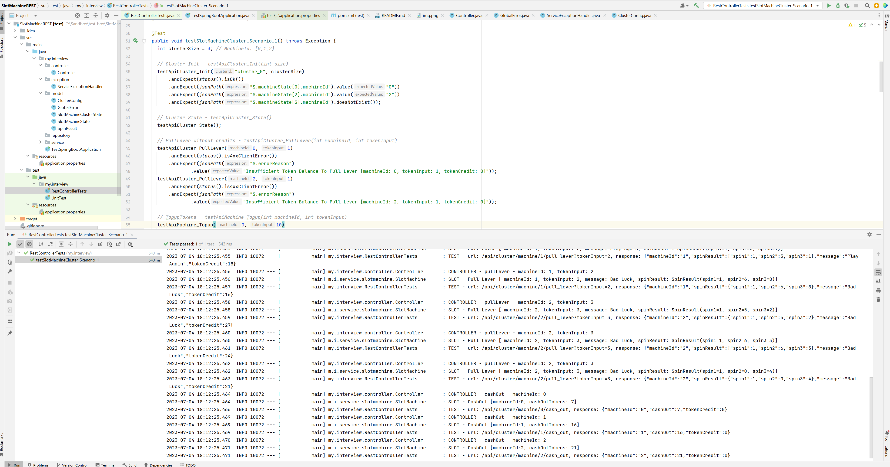

REST API to emulate Slot Machine functionality 

API examples:
- /api/cluster/init?size=3   (will generate cluster with  slotMachineIds: [0,1,2])
- /api/cluster/status
- /api/cluster/machine/{id}/topup_tokens?tokenInput=10
- /api/cluster/machine/{id}/pull_lever?tokenInput=2
- /api/cluster/machine/{id}/pull_lever   (default tokenInput=1)
- /api/cluster/machine/{id}/cash_out
- /api/cluster/machine/{id}/status


How to run tests:
1. From command line, will run test to have predefined output in logs - mvn clean install   
2. From IDE (IDEA) - run /test/RestControllerTests.testExchangeMachine_Scenario_1() test
3. from Postman - run APIs in Postman


Run test from IDEA example:
```
@Test
public void RestControllerAdviceTests() throws Exception {
int clusterSize = 3; // MachineId: [0,1,2]

    // Cluster Init - testApiCluster_Init(int size)
    testApiCluster_Init("cluster_0", clusterSize)
        .andExpect(status().isOk())
        .andExpect(jsonPath("$.machineState[0].machineId").value("0"))
        .andExpect(jsonPath("$.machineState[2].machineId").value("2"))
        .andExpect(jsonPath("$.machineState[3].machineId").doesNotExist());

    // Cluster State - testApiCluster_State()
    testApiCluster_State();

    // PullLever without credits - testApiCluster_PullLever(int machineId, int tokenInput)
    testApiCluster_PullLever(0, 1)
        .andExpect(status().is4xxClientError())
        .andExpect(jsonPath("$.errorReason")
                .value("Insufficient Token Balance To Pull Lever [machineId: 0, tokenInput: 1, tokenCredit: 0]"));
    testApiCluster_PullLever(2, 1)
        .andExpect(status().is4xxClientError())
        .andExpect(jsonPath("$.errorReason")
                .value("Insufficient Token Balance To Pull Lever [machineId: 2, tokenInput: 1, tokenCredit: 0]"));

    // TopupTokens - testApiMachine_Topup(int machineId, int tokenInput)
    testApiMachine_Topup(0, 10)
        .andExpect(jsonPath("$.machineId").value(0))
        .andExpect(jsonPath("$.tokenCredit").value("10"))
        .andExpect(status().isOk());

    testApiMachine_Topup(1, 20)
        .andExpect(status().isOk())
        .andExpect(jsonPath("$.machineId").value(1))
        .andExpect(jsonPath("$.tokenCredit").value("20"));

    testApiMachine_Topup(2, 30)
        .andExpect(status().isOk())
        .andExpect(jsonPath("$.machineId").value(2))
        .andExpect(jsonPath("$.tokenCredit").value("30"));
    testApiCluster_State();

    // PullLever with tokens - testApiCluster_PullLever(int machineId, int tokenInput)
    testApiCluster_PullLever(0, 1).andExpect(status().isOk());
    testApiCluster_PullLever(0, 1).andExpect(status().isOk());
    testApiCluster_PullLever(0, 1).andExpect(status().isOk());
    testApiCluster_PullLever(1, 2).andExpect(status().isOk());
    testApiCluster_PullLever(1, 2).andExpect(status().isOk());
    testApiCluster_PullLever(1, 2).andExpect(status().isOk());
    testApiCluster_PullLever(2, 3).andExpect(status().isOk());
    testApiCluster_PullLever(2, 3).andExpect(status().isOk());
    testApiCluster_PullLever(2, 3).andExpect(status().isOk());
    // testApiCluster_State();

    // CashOut - testApiMachine_CashOut(int machineId)
    testApiMachine_CashOut(0)
        .andExpect(jsonPath("$.machineId").value(0))
        .andExpect(jsonPath("$.cashOut").isNotEmpty())
        .andExpect(jsonPath("$.tokenCredit").value("0"))
        .andExpect(status().isOk());
    testApiMachine_CashOut(1)
        .andExpect(jsonPath("$.machineId").value(1))
        .andExpect(jsonPath("$.cashOut").isNotEmpty())
        .andExpect(jsonPath("$.tokenCredit").value("0"));
    testApiMachine_CashOut(2)
        .andExpect(jsonPath("$.machineId").value(2))
        .andExpect(jsonPath("$.cashOut").isNotEmpty())
        .andExpect(jsonPath("$.tokenCredit").value("0"));
    // testApiCluster_State();
}
```

